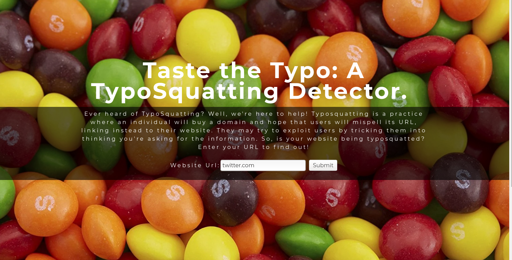
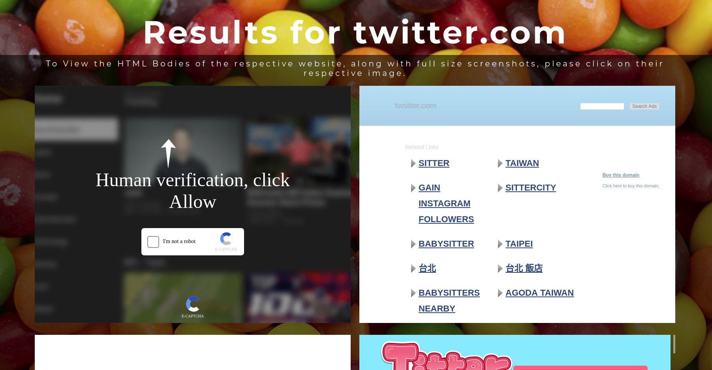
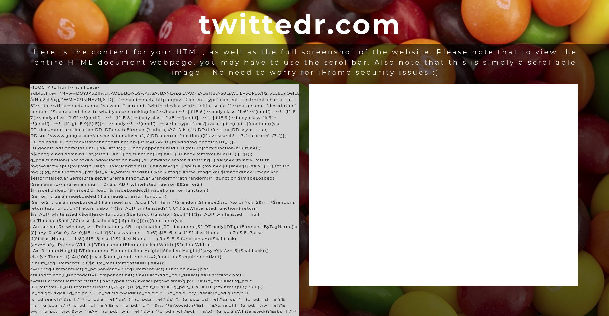
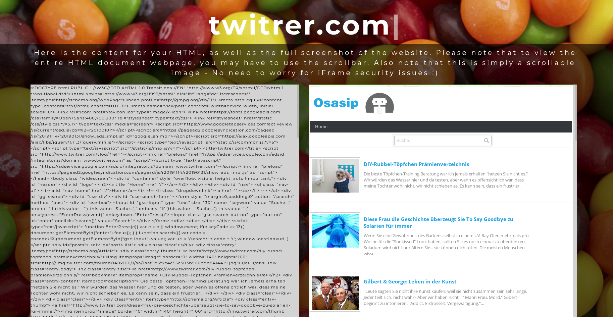

# Taste the Typo!

Taste the Typo is a distributed typosquatting detector that enables users to control it via web dashboard.

**What is Typosquatting?**

Typosquatting is the malicious practice of registering a domain similar to a popular one, and then trying to get traffic to it and perform malicious acts to visitors. This could be a number of things - phishing, running malicious cross site scripting, etc.

**The Basics**

The user opens up the webapp and types in the URL of the website they are trying to find typosquatters of.

The webapp then connects via TCP to a server, which in turn generates spelling error permutations that a typosquatter may choose. These permutations are then distributed to worker nodes, which run headless chrome browsers to check the website for its existence. If it does exist, the worker nodes will save the HTML and screenshot the website, then send it back to the masternode. It is then sent back to the webapp and results are displayed dynamically as they are generated.

Upon clicking on a respective screenshot, you are taken to a page with the URL of the website, alongside its HTML and its screenshot - all of which are more easily scrollable. If the search has already been conducted, then the saved results will be displayed, so wait time is rendered effectively nonexistent.

**Running the Project**

Because this project is in development mode, we must run this project from the terminal. If you are not running a Linux machine, you may have trouble doing so To do so, simply cd into typosquatted and run the django server via manage.py. Worker nodes can be established via VM or simulated locally with workernodelocal.py. The webapp is accessed at 127.0.0.1:8000/home/

**Technologies**

This project is dependent upon the usage of pyppeteer - an unofficial port of Puppeteer from javascript to Python. Django was the web framework used, alongside simple HTML, CSS and Javascript.

**Credits**

This project was designed and coded by myself, James Castro and fellow Computer Science students, William Braxton, Nathan Chan and Joey Spivack. Much of this project was written on different machines where multiple people used improperly configured credentials, and as such, commits in insights != accurate.

*Note: The project you are viewing is not deployed on the web currently.*

    
